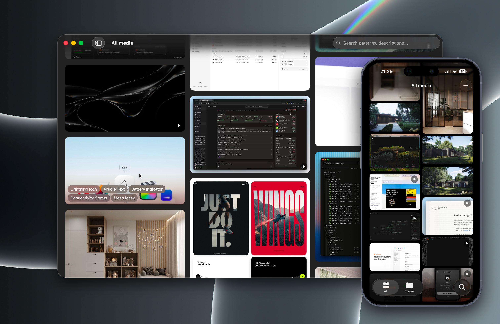

# Snapwell — Your inspiration, organized by AI

Collect anything, search by what you see. An open-source inspiration library for macOS and iOS.



Built by [@gustavscirulis](https://github.com/gustavscirulis).

## How it works

1. **Import images and videos** — Screenshots, photos, video, web images. Drag in, paste, or share from any app.
2. **AI tags everything** — Every image gets analyzed automatically. Add guidance to focus on what matters to you.
3. **Search by what you see** — Describe an object, a layout, a mood. Snapwell finds the match — no tags or folders needed.

## Built for visual thinkers

- **UI design** — UI patterns, login flows, component states, animations. Build a searchable reference library of interface design.
- **Home improvements** — Interior design ideas, furniture, paint swatches, room layouts. Organize into spaces per project.
- **Creative inspiration** — Art, typography, photography, fashion, video references. Let AI find connections across your collection.

## Features

- **On-device storage** — All images, metadata, and preferences stay on your devices and your iCloud — not our servers
- **AI-powered analysis** — Categorize and tag using OpenAI, Claude, Google Gemini, OpenRouter, or Ollama running locally on your Mac
- **Custom analysis prompts** — Configure AI instructions per space for tailored categorization
- **Spaces** — Organize images into collections with drag-and-drop and per-space export
- **Search by content** — Find images based on what AI detected in them, not filenames
- **iCloud sync** — Sync your library between Mac and iOS
- **iOS Share Extension** — Send images and videos to Snapwell from any app
- **Video support** — Import and analyze video alongside images

## Privacy

No subscription. No account. Open source.

Your library lives on your devices and your iCloud — not our servers. Snapwell has zero analytics, zero telemetry, and zero tracking. Cloud analysis goes directly from your device to the provider you choose, while Ollama analysis stays on your Mac. See [PRIVACY.md](PRIVACY.md) for details.

## Installation

Download from the [App Store](https://apps.apple.com/us/app/snapwell/id6762541353) (Mac and iOS), or build from source.

### Requirements

AI analysis requires either an API key for OpenAI, Anthropic (Claude), Google Gemini, or OpenRouter, or Ollama 0.6+ running on your Mac with an installed vision model such as `gemma3:4b`. Ollama analysis is Mac-only; items saved on iOS are analyzed after they sync to the Mac. The app works without AI too — you just won't get automatic tagging and search.

## File storage

Snapwell stores files in `~/Documents/Snapwell/` or iCloud Drive:

- `images/` — Media files (PNG, MP4, etc.)
- `metadata/` — JSON sidecar for each media item
- `thumbnails/` — Generated thumbnails
- `spaces.json` — Space definitions and AI prompt configuration
- `.trash/` — Deleted items (auto-emptied after 30 days)
- `queue/` — iOS import staging, auto-watched by the Mac app

## Development

Snapwell is built with Swift 6, SwiftUI, and SwiftData. The Mac app uses [XcodeGen](https://github.com/yonaskolb/XcodeGen) for project generation.

### macOS

```sh
cd macos
xcodegen generate
open Snapwell.xcodeproj
```

### iOS

```sh
open ios/Snapwell.xcodeproj
```

### Running tests

```sh
# Mac
cd macos && xcodegen generate && xcodebuild test \
  -project Snapwell.xcodeproj -scheme Snapwell \
  -destination 'platform=macOS' 2>&1 | xcbeautify --quiet

# iOS
cd ios && xcodebuild test \
  -project Snapwell.xcodeproj -scheme Snapwell \
  -destination 'platform=iOS Simulator,name=iPhone 17 Pro' 2>&1 | xcbeautify --quiet
```

## Contributing

Contributions welcome — open a Pull Request or file an issue.

## License

This project is licensed under the GNU General Public License v3.0 — see [LICENSE](LICENSE) for details. As an additional permission under GPL-3.0 section 7, this software may be distributed through the Apple App Store.

## Acknowledgments

- Built entirely with [Claude Code](https://claude.ai/code) by Anthropic
- App icon by [Midjourney](https://www.midjourney.com/)
- AI analysis powered by [OpenAI](https://openai.com/), [Anthropic](https://anthropic.com/), [Google Gemini](https://deepmind.google/technologies/gemini/), [OpenRouter](https://openrouter.ai/), and [Ollama](https://ollama.com/)
